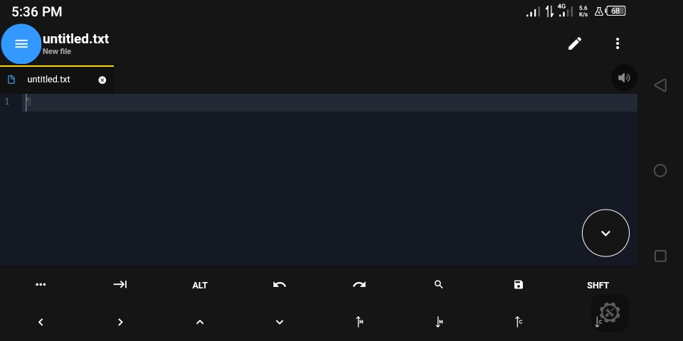
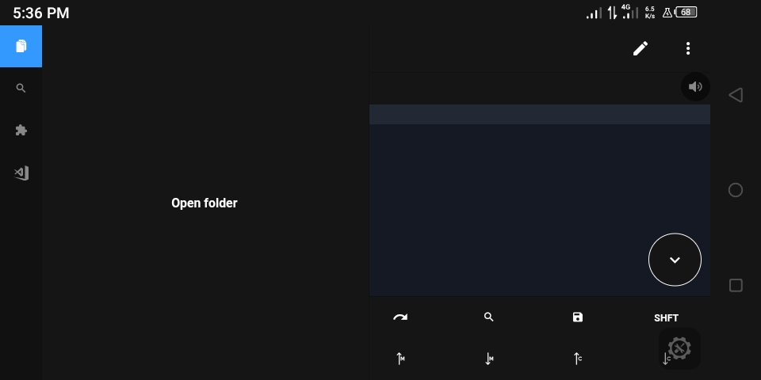
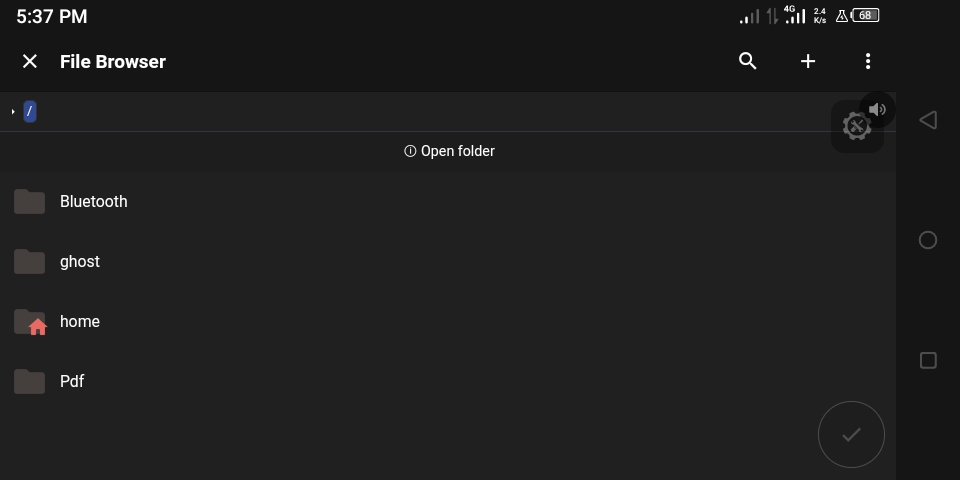
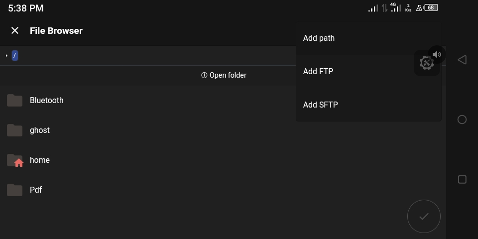
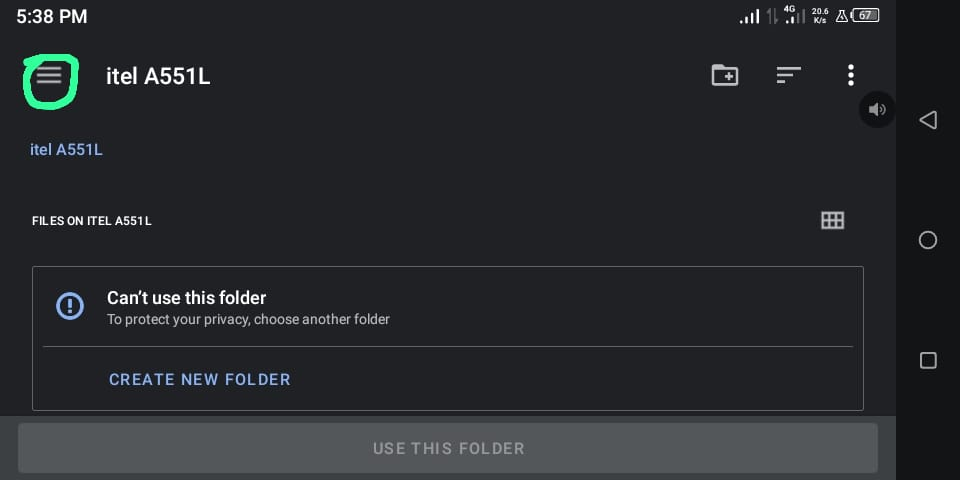
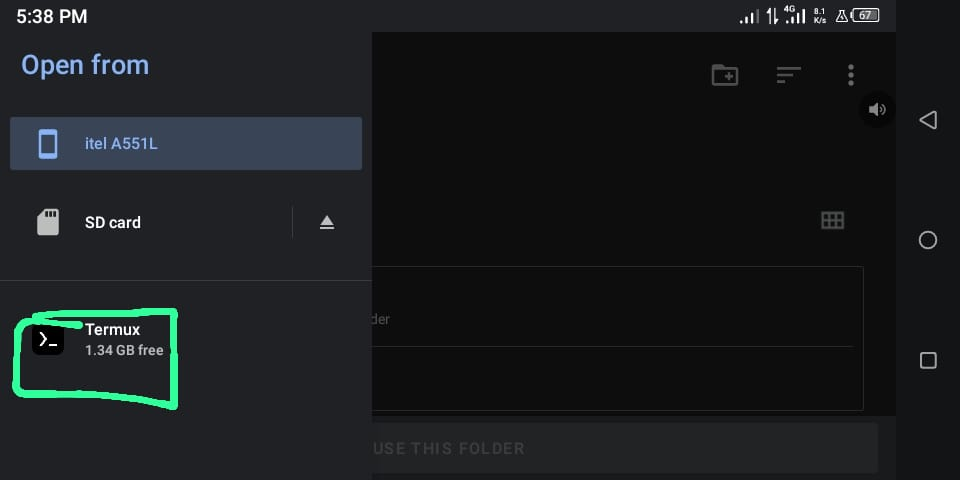
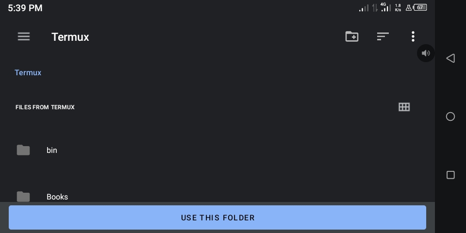
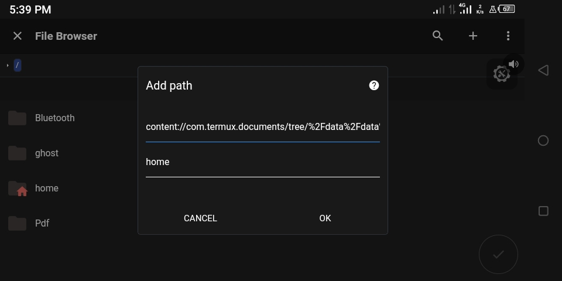
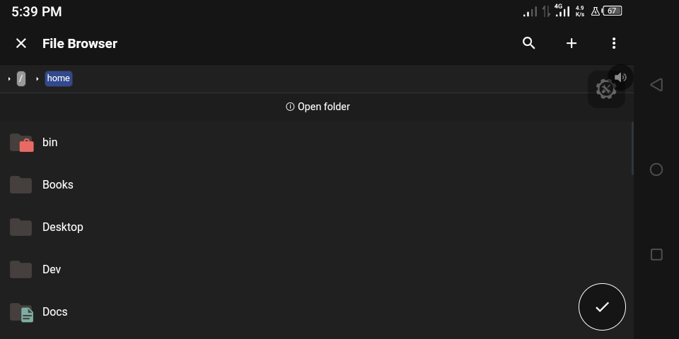

# Getting Started with Rust on Android
## 1. Install Termux
Download Termux from this [link](https://f-droid.org/repo/com.termux_118.apk). Install then launch the apk.

## 2. Updating & Upgrading your Packages
Type the following command
```
 yes | pkg upgrade
``` 
Then hit enter.

## 3. Install Rust
Type the following command
```
pkg install rust
``` 
Then hit enter.

## 4. Installing the Editor (Optional)
Download Acode from this [link](https://github.com/deadlyjack/Acode/releases/download/v1.10.3/app-release.apk) or from Play Store. Install then launch the apk.

## 5. Linking the Editor to Termux (Optional)


Click on these **three horizontal lines**.


Select **Open Folder**.


Click on the **+** in the top right corner.


Select **Add path**.


Click on **Select Folder**.


Click on these **three horizontal lines**.


Select **Termux**.


Click on **USE THIS FOLDER**.


Click **Ok**.


This folder **home** is your Termux `$HOME`.